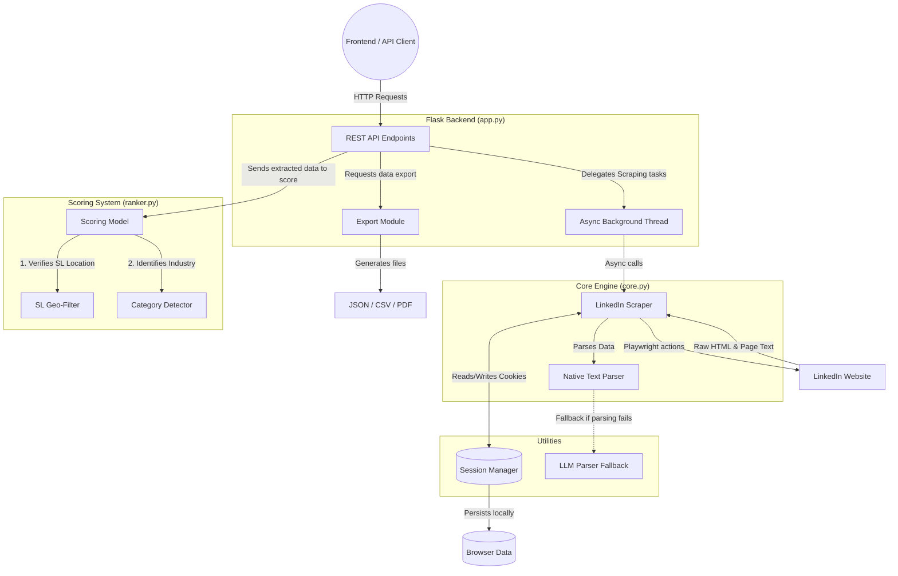

# Persona: LinkedIn Scraper and Ranker - Architecture & Flowchart

## Project Architecture

The "Persona" application follows a modular architecture designed to handle synchronous API requests while running asynchronous browser automation tasks in the background.

1. **Client / Presentation Layer:** Any HTTP client (or web frontend) that makes requests to the Flask API.
2. **API & Routing Layer (`app.py`):** A Flask web server that handles incoming requests. Crucially, because Flask is synchronous and Playwright is asynchronous, this layer implements a dedicated background `asyncio` event loop thread (`_bg_loop`) to safely execute browser commands without blocking the main web server.
3. **Scraping & Automation Layer (`core.py`):** The engine of the application. It utilizes Playwright to launch a headless Chromium browser, manage authentication, navigate LinkedIn, scroll through lazy-loaded content, and extract raw text and HTML data.
4. **Data Parsing Layer (`core.py` & `llm_parser.py`):** Responsible for turning raw LinkedIn page text into structured JSON. `core.py` implements a robust, native string parsing mechanism that looks for resume section headers. `llm_parser.py` provides an optional fallback utilizing OpenAI's GPT models for unstructured HTML parsing.
5. **Ranking & Evaluation Layer (`ranker.py`):** The business logic module that evaluates the extracted profiles. It filters for Sri Lankan locations, detects the professional category (e.g., Software, Finance), and calculates a score out of 150 points based on profile completeness and industry follower relevance.
6. **Persistence Layer (`session_manager.py`):** Manages browser session cookies to maintain persistent logins, reducing the risk of CAPTCHAs and account restrictions.
7. **Export Layer:** Integrated within `app.py`, it formats the finalized, ranked data into downloadable formats (JSON, CSV, PDF).

---

## Application Flowchart

The following diagram illustrates how data and control flow through the system from an initial user request down to the browser automation and back.

## Step-by-Step Execution Flow

1. **Initialization:** The user requests the `/api/scraper/init` endpoint. Flask forwards this to the background thread which tells Playwright to launch Chromium. If a session is found by the `Session Manager`, it is loaded.
2. **Search Request:** The user triggers `/api/scraper/search`. The Scraper automates typing the query into LinkedIn, scrolling the results page, and extracting the URLs of the top profiles.
3. **Extraction:** The user triggers `/api/scraper/extract` for specific URLs. The Scraper navigates to the profile, scrolls to load all sections, and extracts the raw `innerText`. The `Text Parser` structures this into JSON (using the `LLM Parser` only if configured/needed).
4. **Ranking:** The structured profile data is sent to `/api/rank`. The `Scoring Model` ensures it passes the `Geo-Filter`, uses the `Category Detector` to find the user's field, and assigns a final score and tier.
5. **Export:** The user can hit the `/api/scraper/export` endpoints to download the final scored data as files.
